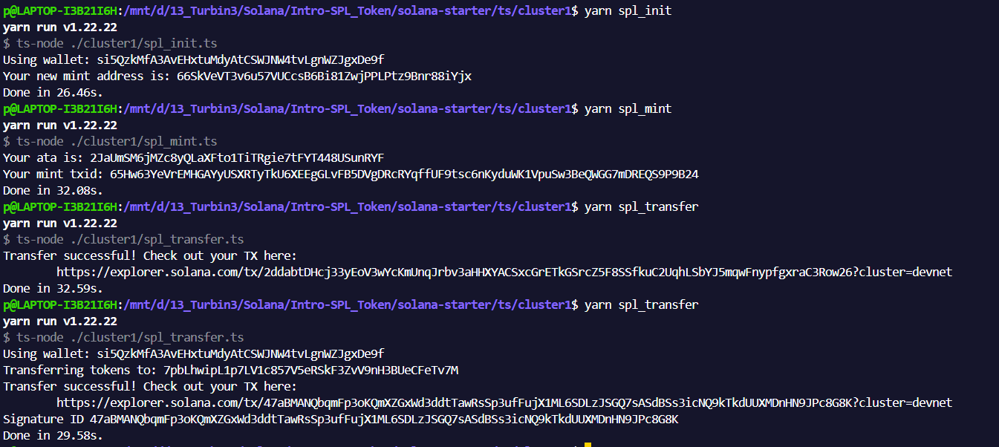
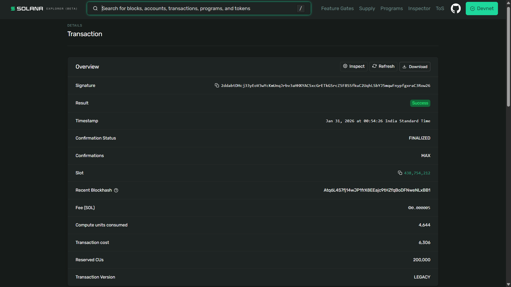
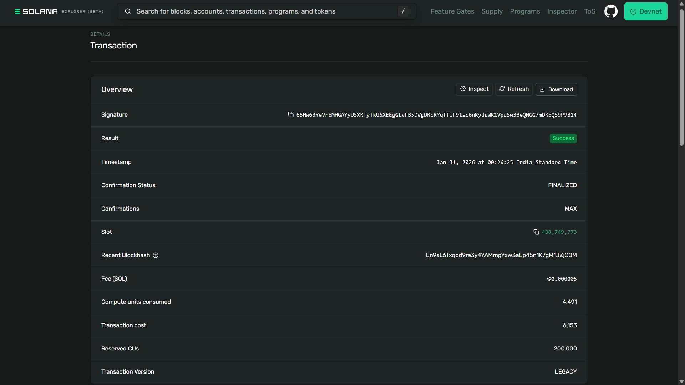
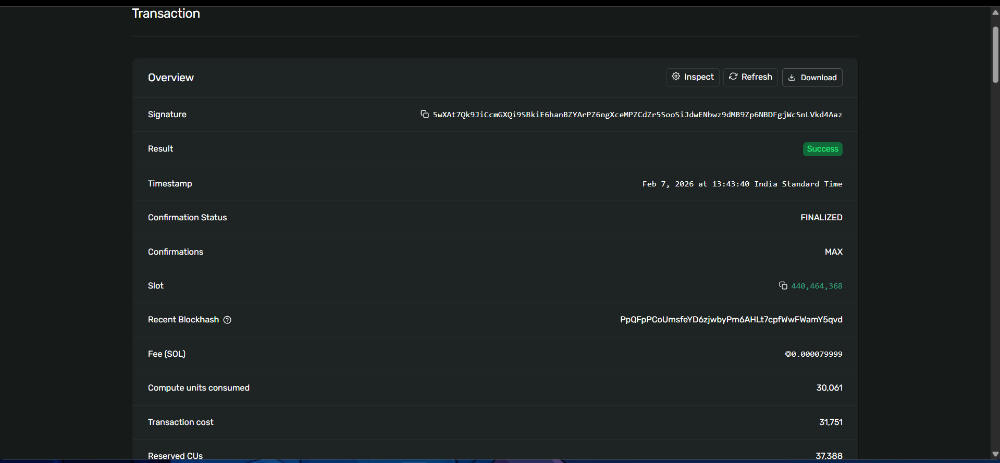

# Assignment 2 – SPL Token Mint & Transfer

## Objective
Minted and transferred SPL Tokens on Solana Devnet.
Minted and Swapped NFTs on Solana Devnet

## Token Details
- **Mint Address:** 66SkVeVT3v6u57VUCcsB6Bi81ZwjPPLPtz9Bnr88iYjx
- **Decimals:** 6
- **Network:** Devnet

## Transactions
- **Mint TX:** 65HW63YeFrEMGAYuSXRyTkU6XE8GLvF5DVgDRCRYqffUf9tsc6nKyduwK1VpuSw3BeQWG7mDREQS9P9B24
- **Transfer TX:** 47aBMANOqbmFp3oKOmXZGxWd3ddtTawRSp3uFfuXjXML6SDLzJSQ7sASdBss3icNQ9ktkDUUXMDnH9JPc8G8K

## NFT Details
- **Hash of Minting** 65HW63YeFrEMGAYuSXRyTkU6XE8GLvF5DVgDRCRYqffUf9tsc6nKyduwK1VpuSw3BeQWG7mDREQS9P9B24
- **Hash of Transfer** 47aBMANOqbmFp3oKOmXZGxWd3ddtTawRSp3uFfuXjXML6SDLzJSQ7sASdBss3icNQ9ktkDUUXMDnH9JPc8G8K
- **NFT Mint Transaction** 5wXAt7k9JiCcmGXQi9SBkiE6hanBZYArPZ6ngXceMPZcdZr5SooSiJdwENbwz9dMB9zp6NDFgjWcSnLvkd4Aaz

## Screenshot

## What I Learned:
- Creating an SPL token mint
- Associated Token Accounts (ATA)
- Minting tokens
- Transferring tokens on Solana

---
